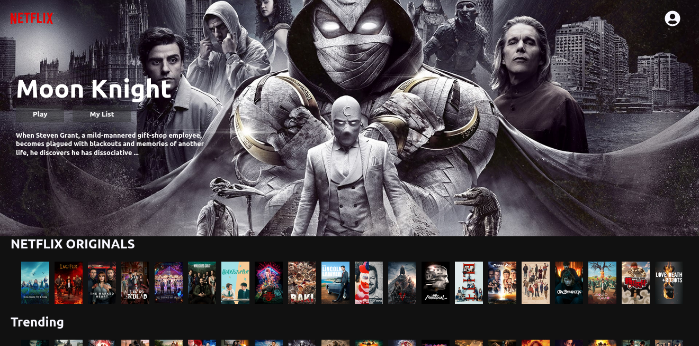
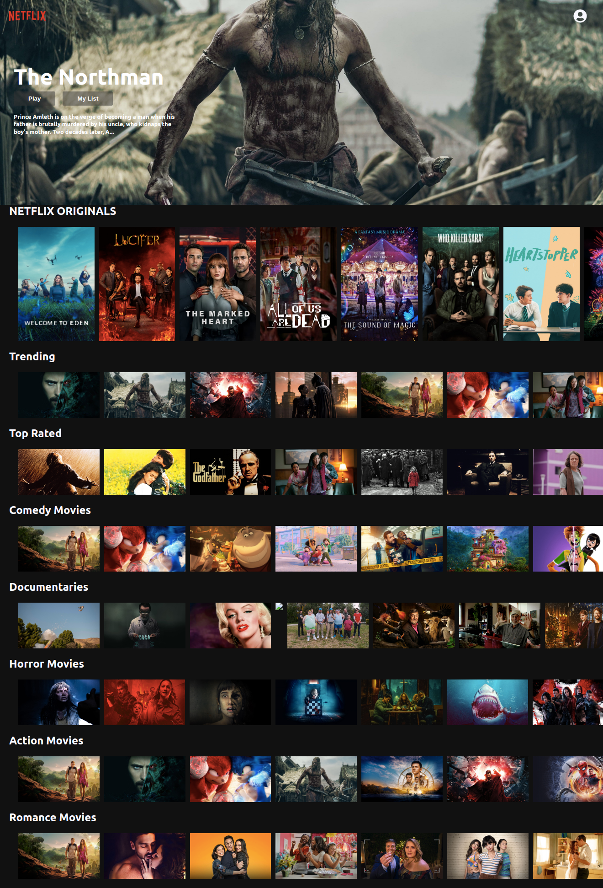

# Netflix clone with ReactJs

Live site [here](https://netflix-clone-daf5a.web.app)

## Overview

- Challenged myself to do a clone of the netflix ui, definitely worth it
- Added a feature that plays the movie trailer when the movie poster is clicked.

## Dev Steps

- ✅Get TMDB Api key
- ✅Setup hosting, firebase or netlify
- ✅Get all the movies
- ✅Build the rows
- ✅Build the Banner
- ✅Build navbar
- ✅Add trailer popups

  
  

